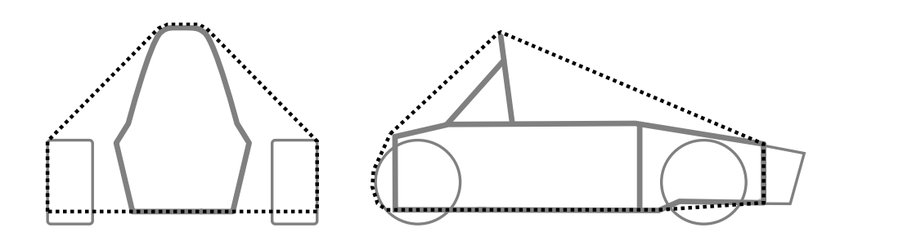
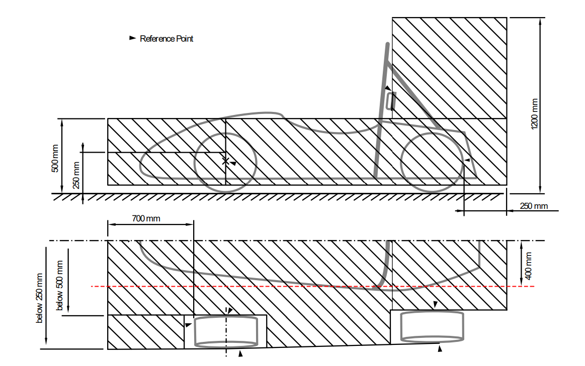
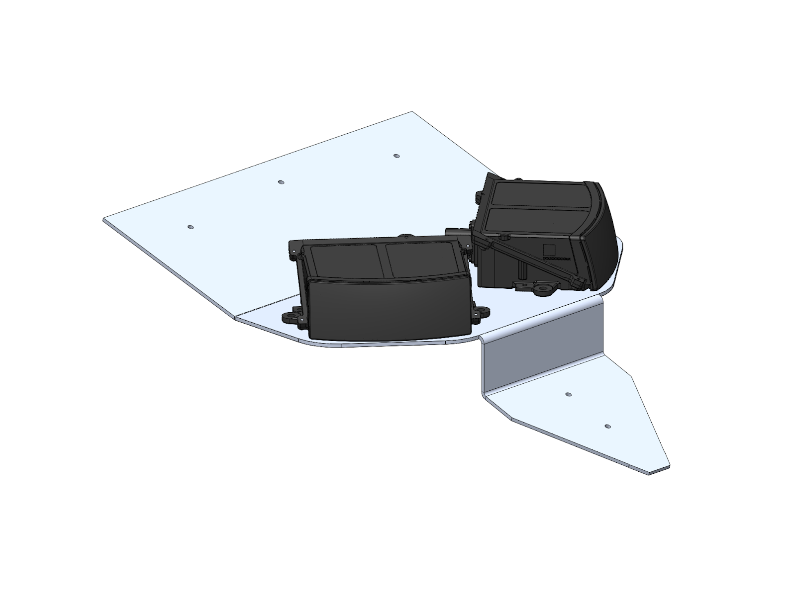
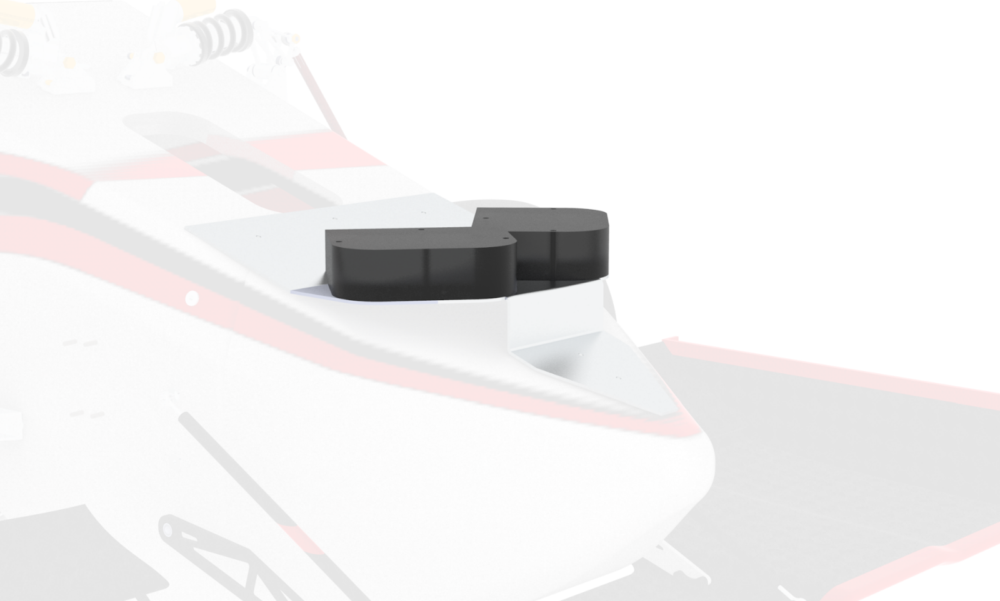
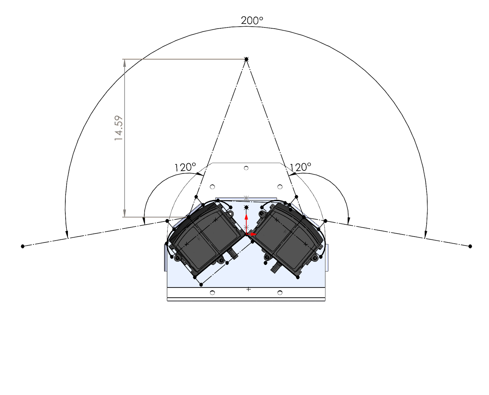
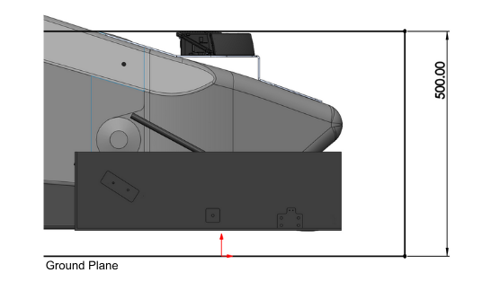
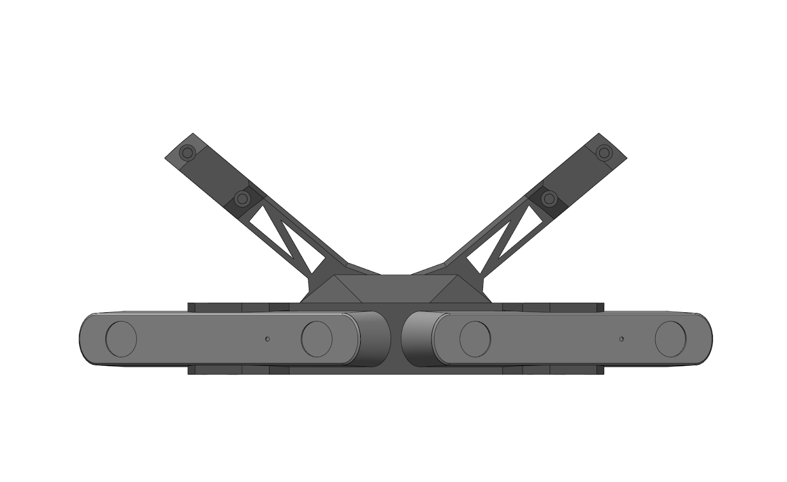
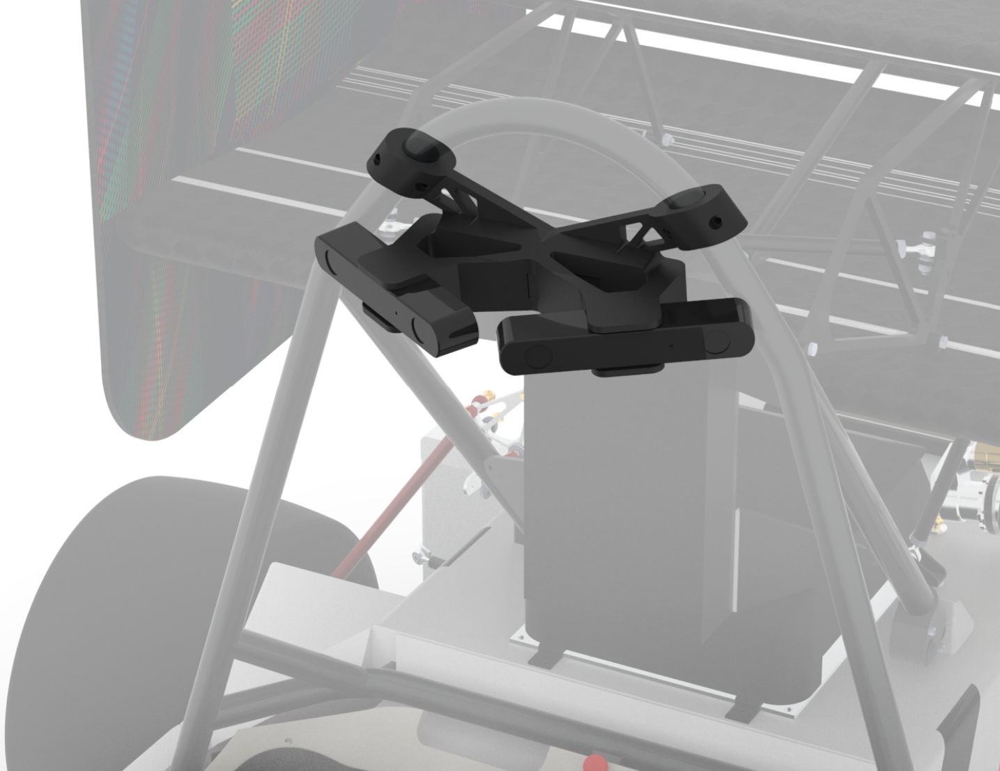
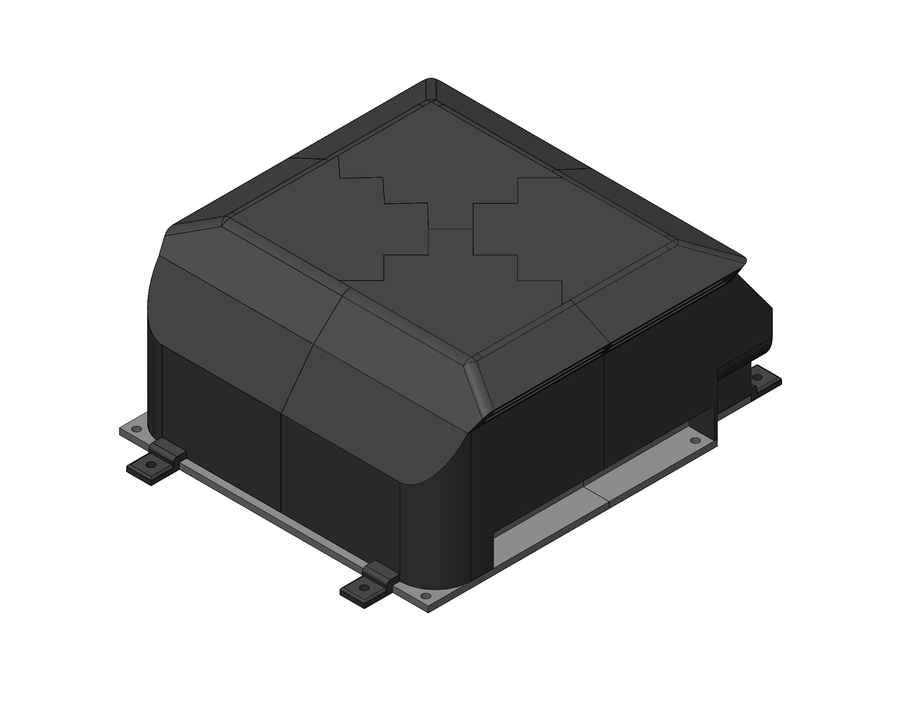
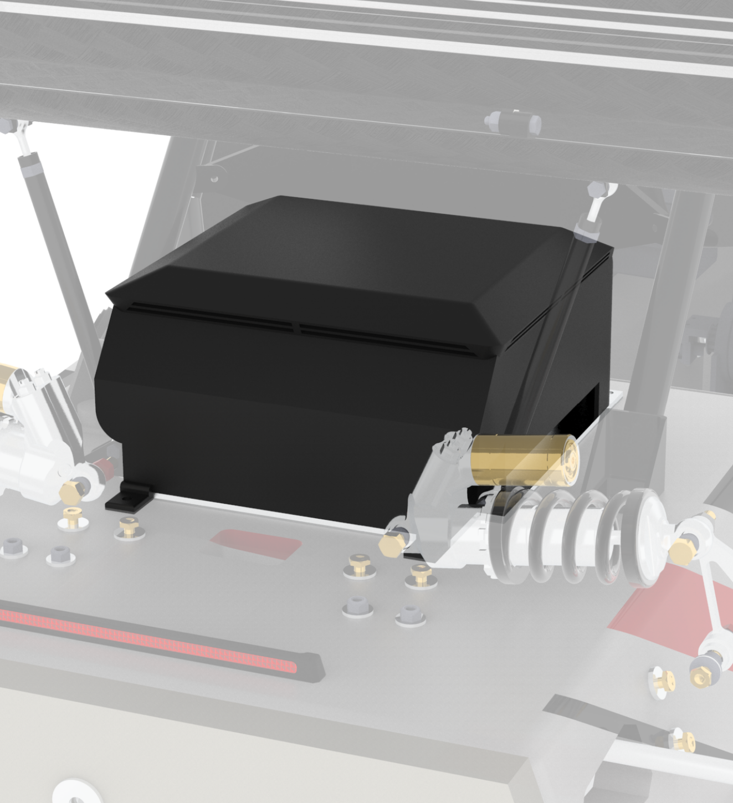

Electrical Integration
===========================

Electrical Integration involves the mounting and packaging of driverless electrical hardware. This includes an onboard computer, several sensors, and custom PCB boards.

Rules Overview:
------------------

Below are rules from the 2025 FSAE Driverless Supplement that constrained vehicle retrofitting solutions. These rules define the 3D space which sensors, an onboard computer, and electrical hardware could mount within. Additionally to pass technical inspection, the vehicle will undergo a rain test, requiring all electronics to be water proof.

**DT.2.3 Sensor Camera and Electronics Mounting**

All Driverless System components, including sensors and cameras must be positioned inside one or both: 

a. The volume formed by the Primary Structure F.1.10, Tire Surface Envelope F.1.13, the outside surfaces of the tires, and the plane formed by the bottom of the chassis  

    Sensor Mounting Surface Envelope 

b. The permitted locations for Aerodynamic Devices T.7.5, T.7.6, T.7.7

    Aerodynamics Box

DT.2.3 defines the available area that electrical hardware can be mounted within. 

**T3.19.4**

Vehicles with aerodynamic devices and/or sensors in front of the front bulkhead must not
exceed the peak deceleration of T3.19.1 for the combination of their IA assembly and the
non-crushable object(s). One of the following three methods must be used to prove the
design does not exceed 120 kN:

    - Physical testing of the IA assembly including any attached non-crushable object(s) or structurally representative dummies thereof in front of the AIP. When non-crushable object(s) are located in front view of the AIP, physical testing is required.

    - Combining the peak force from physical testing of the IA assembly with the failure load for the mounting of the non-crushable object(s), calculated from fastener shear and/or link buckling.

    - Combining the “standard” IA peak load of 95 kN with the failure load for the mounting of the non-crushable object(s), calculated from fastener shear and/or link buckling.

T3.19.4 defines the shear off rule for sensor mounts connected to the monocoque that extend past the Impact Attentor. 

System Design:
-----------------

The scope and design requirements for these systems are derived based on software and electrical needs outlined in their respective sections. 

To provide location and vision data to software, several sensors need to be integrated onto the vehicle. This includes: 

1. LiDAR for cone position

2. Cameras for cone coloring, and 

3. An IMU to track the vehicle's position.

The vision sensors should be mounted to maximize FOV, limit deadspace, and reduce deflection that changes relative sensor distance. This ensures precise and accurate data about cone location and color is given to the perceptions. The IMU should be mounted on the center line of the vehicle to provide accurate positioning and speed data. 

The compute size and specifications are determined by software computational requirements. The main requirements for a compute are that it must be mounted somewhere on the vehicle that minisizes wire length, allows for proper cooling, and allows for proper waterproofing while keeping the compute ports easily accessible.

All custom printed circuit boards are required by rule specifics to be water proofed but should still have port accessibility for electrical integration. 

Our Implementation:
-----------------------

To mount the GPS and custom PCBs, 3D printed enclosures were created for various mounting locations defined by area available within rule specifics on the retrofitted vehicle.

Highlighted below were the mounts and enclosures which required primary attention in design and manufacturing.

**LiDAR**

The mount supports two 120° Hesai LiDARs, angled to provide a total FOV of 200°. For adaptability purposes, the mount also contains holes in the middle to be changed to a singular LiDAR. The mount was designed to have a clear line of vision for cones in front of the vehicle.

    LiDAR Mount within Aerodrymic Box

The mount is located on top of the vehicle's nosecone, positioning the LiDARs within the Aerodynamics Box. To minimize deflection to less than 0.5mm and add support, the back tab attaches to the monocoque near the front bulk head. This tab was required to follow T3.19.4, limiting bolt usage to three aluminum 10-32 bolts. 

**Cameras**

The camera mount supports two ZED cameras, oriented to create a total FOV of 180°. The mount clamps onto the Main Roll Hoop providing the largest FOV of the vehicle. The mount was 3D printed with PLA and contains heat inserts to interface with camera bolts. 

**Compute**

The computer enclosure was 3D printed with ASA-CF and is located under the rear wing. It consists of four top pieces which were plastic welded together and one baseplate. Both pieces have inserts into the chassis. 

The top of the enclosure features air inlets for cooling. The inlets passively direct air to the compute fans to keep it cool, this was validated through heat testing with the compute and enclosure 3D prints. The inlets have a water maze that limits moisture entrance. It also meshes with the baseplate to block any water flow into the ports or sides. 
