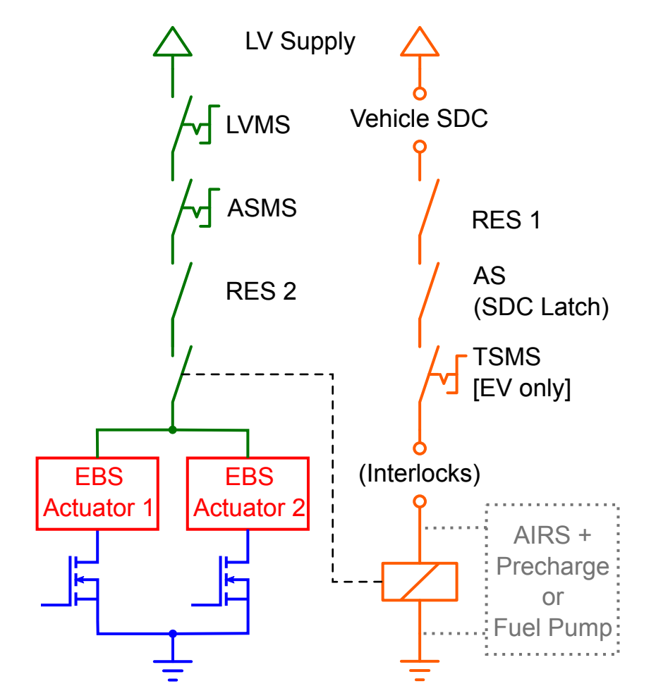

Driverless Electrical Hardware
===============================

Autonomous Interface Module (AIM)
------------------------------------
The Autonomous Interface Module is designed and retrofitted to facilitate the communication between the driverless software pipeline and the 24a's existing electrical architecture. The custom STM32 based module is responsible for the following roles:
Relaying control actions sent from the onboard compute to the vehicle through CAN
Driving and controlling the LED logic of the DSSI
Analog conditioning for the pneumatic brake pressure sensors
Performing driverless system safety checks prior to state change
Houses the Driverless System Relay noted in FSAE DT.4.1
Houses the Emergency Brake System Relay noted in FSAE DT.4.3

Autonomous Mission Indicator (AMI)
-------------------------------------------------
The Autonomous Mission Indicator is to satisfy the requirements of FSAE DO.1.4. 24a AMI was designed as a custom STM32 board equipped with a rotary selector and LEDs to display the currently selected driverless mission, and the selected mission ID broadcasted onto CAN. 

Driverless System Status Indicator (DSSI)
---------------------------------------------------
Driverless System Status Indicator consists of blue and yellow indicators required by FSAE DT.1.2,  visually indicating the vehicle's current driverless state. 24a is equipped with three pairs of commercially available 12VDC LED strips to satisfy this requirement, with two pairs on each side of one pair on the rear element of the rear wing. The DSSI logic are as follows:

DS Off: Off
DS Ready: Yellow continuous (Vehicle in HV Enable, Ready-to-Drive; all safety checks met, ready to initiate selected driverless mission.)
DS Driving: Yellow flashing (Vehicle currently initiating the selected driverless mission.)
DS Finished: Blue continuous (Vehicle has completed the selected driverless mission and is at a standstill.)
DS Emergency: Blue flashing (Vehicle has encountered an emergency, either through the RES or upon entering its own error states. EBS actuates as the shutdown circuit opens.)

FSAE DT.1.3 requires the Driverless Alert Sound to be triggered when the vehicle is in the state of DS Emergency. 24a utilizes the existing Ready-to-Drive buzzer to fulfill this requirement. During the driverless electrical technical inspection, teams are required to showcase an “inspection” mission to verify the correct functionality of the DSSI, the Driverless Alert Sound, as well as the correct behavior of the EBS at various vehicle states. 

Driverless System Master Switch (DSMS)
----------------------------------------------------
Driverless System Master Switch is an additional master switch by the existing GLVMS and TSMS, required for driverless vehicles. The DSMS is in series with post-GLVMS, serves as an input to Driverless System relay and Emergency Brake System relay logic, and directly supplies power to the Remote Stop relay, allowing the switching between manual and driverless modes.

Steering Motor and Driver
------------------------------------------------
24a utilizes an additional steering motor in part of the Autonomous Steering System. The selected motor, Maxon EC Flat, is paired with the EPOS series motor controller to enable the control of the system. Steering control actions are sent via CAN from the onboard computer to AIM. PID control loop processes these commands against feedback from the steering angle sensor, translating the output into appropriate ADC values for the motor controller to achieve the target steering angle position. The steering angle sensor, installed on 24a's steering rack, is calibrated by attaching an IMU device onto the front wheels to record angular deviation from the center position, alongside corresponding steering angle sensor ADC values, creating a mapping for accurate feedback.

Driverless System Brake (DSB)
-----------------------------------------------
FSAE DT.3.1 requires driverless vehicles to be equipped with a driverless system brake for use during the driverless missions. 24a utilizes the AMK hub motor's regenerative braking capabilities to meet deceleration targets and is not equipped with an additional actuator.

Remote Emergency Stop (RES) and Relay
-------------------------------------------------
To ensure FSAE DT3.3, 24a implemented a FSG-certified RES system, Gross Funk T53 transmitter and GF2000i R98 receiver. The remote stop relay of the RES is directly hard-wired in series with 24a's safety circuit. The RES has two roles:

Go Button: Transmit “go” signals to initiate the selected driverless mission
Stop Button: Bring 24a to a safe condition remotely by opening the safety circuit, disabling the tractive system, and triggering the EBS relay for the emergency stop. 

An additional normally-closed relay powered off the DSMS ensures the bypass of the remote stop relay of the RES, allowing the manual operation of the vehicle when DSMS is in off state.

Emergency Brake Actuator and Pressure Sensors
-------------------------------------------------------
24a is equipped with two pneumatic brake pressure sensors that provide an accurate reading of the EBS pneumatic line pressures. The output of the sensors are in the analog range of 0.5 ~ 4.5V, which are read through AIM along with the pre-existing hydraulic brake pressure sensors  to be used for safety checks in various states.

Driverless State-up Safety Check (EBS Pulse): Upon entering into a driverless Ready-to-Drive state, AIM briefly enters an error state in order to open the safety circuit, triggering the EBS. At this instance, AIM reads the pressurized EBS brake line pressure and the hydraulic brake line pressure through these sensors and checks if it passes a certain threshold required to fully lock the brakes, ensuring that the car is able to fully stop safely when necessary.

Continuous EBS Tank Pressure Monitoring: During the DS Driving state, AIM continuously checks for any pressure loss below the threshold value in the EBS pneumatic tank, to ensure a safe EBS functionality. In the case of the pressure drop, the EBS relay on AIM is triggered to open the safety circuit and activate the EBS. The threshold is determined to ensure at least a single safe activation before it reaches depletion.

Onboard Computer and Perception Sensors
----------------------------------------------
The onboard computer is the "brain" of the driverless system, processing sensor data, running perception, path planning, and control algorithms. The Cincoze GM-1000 was used as our onboard computer . Our key requirements included:

Power: Ability to take in 24VDC, with sufficient power delivery for all connected peripherals.
Cooling: Adequate cooling solutions were essential given the high processing demands and potential for elevated temperatures in a race car environment.
Interfaces: Ample I/O ports (USB, Ethernet, CAN) for connecting various sensors and connections to the rest of the vehicle.
Processing Power: Sufficient CPU and GPU power to handle the driverless software pipeline's computational requirements, real-time perception and control.

In addition to the onboard computer, 24a is equipped with a Hesai AT128 LiDAR and two ZED stereo cameras for perception sensing. The GM-1000 and the LiDAR are directly powered from LVMS while the stereo cameras are powered from the onboard computer.
