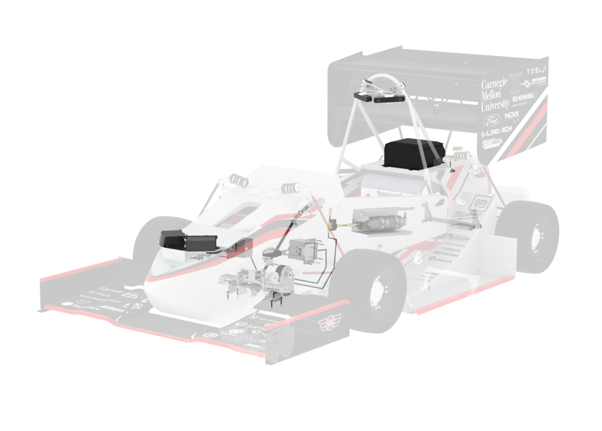

Overview
===========

Mechanically retrofitting a FSAE vehicle for driverless operation involves the integration of systems that enable dual mode actuation for traditionally driver controlled systems. The two systems used to simulate driver motion are the Autonomous Steering System (ASS) and Autonomous System Brake (ASB). These electro-mechanical systems perform steering and braking commands given by the vehicle controller.

Mechanical retrofitting the vehicle also involves integration of driverless sensors and electrical hardware. This includes LiDAR, cameras, IMUs, the onboard computer, and custom printed circuit boards. These systems are implemented to obtain data and execute developed software on the vehicle. 

The actuation and integration of driverless mechanical systems allow for the control of the vehicle with and without a human driver. This documentation will look more in depth at the mechanical systems needed to design a driverless FSAE vehicle system, highlighting a general approach to the problem and executed solution. 

.. toctree::
   :maxdepth: 2
   :caption: Contents:

   steeringsystem
   systembrake
   electricalintegration