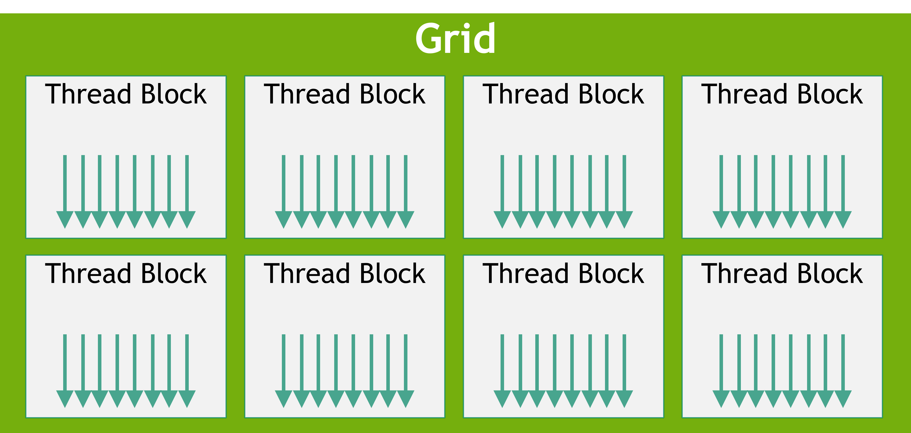

# How to CUDA

Quick and dirty introduction into the concepts behind GPU computation and CUDA. Should be just enough to get started 
writing basic kernels.

Discalimer: I (Griffin) am a bozo who mostly doesn't know what he's talking about. If you want a correct explanation, go 
read the [programming guide](https://docs.nvidia.com/cuda/cuda-c-programming-guide/contents.html). But this has fewer 
words, and at least a little motivation, so my hope is that this may be a gentler introduction.

### Background: Work and Span 

Consider the following C++ algorithm drawing a 2D grayscale gradient to an image:

```c++
void gradient(float image[][], size_t width, size_t height) {
    for (size_t i = 0; i < height; i++) {
        for (size_T j = 0; j < width; j++) {
            image[i][j] = (static_cast<float>(i) / height + static_cast<float>(j) / width) / 2;
        }
    }
}
```

Ok, very cool and epic. Hopefully it's clear that line 4 has `O(1)` time complexity, giving the whole algorithm
a time complexity in  `O(width * height)`. That might be fine for small images, but if we were calling this at 60hz on a
4K screen? It might struggle. (maybe not; im not sure in what magnitude it would stop working. feel free to test this 
yourself)

When analyzing time complexity, we usually make an assumption that we can only compute with one "core"; that is,
only one operation can be done at a time. This specific complexity is called the _work_ of an algorithm. But what if we had unlimited cores?

Notice that the computation on line 4 has no dependence on the result of any other pixel. So if we had as many cores as
we had pixels, we could calculate every pixel at the same time! This minimum time needed with unlimited cores is known 
as the _span_ of an algorithm. In this case, the span is `O(1)`. 

When the span of an algorithm is asymptiotically lower than the work, using more cores
asymptotically decreases time spent on the algorithm! (more info: [Amdahl's Law](https://en.wikipedia.org/wiki/Amdahl%27s_law))

### CPUs vs GPUs

Consider two choices of machines that you might compute the algorithm above on:

| Machine 1        | Machine 2                   |
|------------------|-----------------------------|
| 12 cores @ 5 GHz | in the thousands @ ~0.1 GHz |

Each core in Machine 1 runs much faster. But there are _way_ more cores on Machine 2. Once there are more than even 50 pixels,
it makes more sense to use Machine 2 (assuming no other costs associated with using machine 2).

These specs are actually a rough approximation of the CPU and GPU on my laptop. GPUs have variable 
parallelism depending on the nature of your workload, so it doesn't make much sense to talk about cores in the same way. 
But you can expect to run at least a couple thousand threads at once, and potentially many more with [certain 
memory access patterns](https://docs.nvidia.com/cuda/cuda-c-programming-guide/index.html#multiprocessor-level).

In any case, were I to run this locally, I would really want
to leverage my GPU!

### CUDA Basics

So how do you run code on the GPU?

#### Tangent: Shaders (probably skip, purely for context)

Back when GPUs were first manufactured, they had exactly one purpose: two render graphics. That was it. Nothing else.
Since there are lots of pixels on a screen which can be colored independently, this inspired the highly 
parallel nature of GPUs. But, their programming interface was specialized specifically for rendering pipelines.

GPUs could (and do) run small programs called _shaders_, which could only perform a couple functions:
  1. Take vertices in world space and transform them into screen space (Vertex Shaders)
  2. Take a pixel on a screen and color it (Fragment Shaders)
  3. Some others (Geometry Shaders, Tesselation Shaders, ...)

These were stitched together into a _graphics pipeline_, which could take a collection of meshes, materials, and lights
in 3D space and render what a camera might see. 

Eventually many programmers realized that GPUs could be used for a lot more, but the programming interface wasn't there.
Many developers began writing "compute shaders", where they would reduce their problem to the graphical rendering problem
and display to an off-screen framebuffer (a fake display in memory), then interpret the result from there.

Around 2005 NVIDIA decided this was remarkably dumb and developed a more general interface for their GPUs called CUDA.
For some reason neither AMD nor Intel has gotten the message in almost 20 years that they might want to do the same (you can use 
the Khrono Group's OpenCL if you'd like, though it's much slower and significantly less ergonomic than CUDA).

#### CUDA C++

CUDA acts as both an API that can be called from any language, and as a language extension for C++. We'll be using the
latter.

#### Host and Device

CUDA models your system, regardless of physical implementation, as containing one **host** and any number of **devices**.
The host acts as something of a conductor for program execution, controlling the top-level flow of the program and dispatching
workloads to devices.

Essentially always, the host will be a CPU with its virtual memory space, and the device will be a GPU with its own memory spaces.

When the host program exits, so does the process ("CUDA context") running on each device.

For the purpose of this introduction, we'll assume there's exactly one device present.

##### Kernels

Device program entry points are known as **kernels**. Let's say we wanted to write a device program adding two vectors.
Such a kernel might look as follows:

```c++
__global__ void vec_add(float a[], float b[], float sum[], size_t N) {
    const uint tid = blockIdx.x * blockDim.x + threadIdx.x;
    if (tid >= N)
        return;
    
    sum[tid] = a[tid] + b[tid];
}
```

If we wanted to launch this kernel from the host:

```c++
void cuda_vec_add(float a[], float b[], float sum[], size_t N) {
    const size_t vec_bytes = N * sizeof(float);
    
    float* d_a = cudaMalloc(vec_bytes);
    float* d_b = cudaMalloc(vec_bytes);
    float* d_sum = cudaMalloc(vec_bytes);
    
    cudaMemcpy(d_a, a, vec_bytes, cudaMemcpyHostToDevice);
    cudaMemcpy(d_b, b, vec_bytes, cudaMemcpyHostToDevice);
    
    vec_add<<<(N - 1) / BLOCK_SIZE + 1, BLOCK_SIZE>>>(d_a, d_b, d_sum, N);
    
    cudaMemcpy(sum, d_sum, vec_bytes, cudaMemcpyDeviceToHost);
    
    cudaFree(d_a);
    cudaFree(d_b);
    cudaFree(d_sum);
}
```

Let's go over the less transparent lines:

```c++ 
__global__ void vec_add(float a[], float b[], float sum[], size_t N)
```

The `__global__` specifier declares this function to be a kernel. Kernels must always be voids, but other than that
there aren't many restrictions on the signature. There are many restrictions on what you may do _in_ a kernel,
which you can find [here](https://docs.nvidia.com/cuda/cuda-c-programming-guide/index.html#c-language-support).

```c++
const uint tid = blockIdx.x * blockDim.x + threadIdx.x;
```
Each kernel launch spawns a configurable number of nearly identical threads. The threads are grouped into **blocks**, 
which themselves belong to a **grid**:



This has very little correspondence to any hardware implementation, _except_ that threads within a block have access
to a cache of fast, shared memory, and some synchronization primitives. In our case, we don't care about any of this, 
and we just want to calculate a unique id for each thread. 

Each thread can access a handful of builtin symbols of type `dim3` (`{ uint x; uint y; uint z; }`) indicating its position within the grid:
- `threadIdx`, the thread's position within the block
- `blockDim`, the dimensions of the block
- `blockIdx`, the block's position within the grid
- `gridDim`, the dimensions of the grid

Each thread can also access an `int` called `warpSize` (look at the GPU Architecture section for an explanation of warps).
This will be equal to 32 on any modern device.

```c++
float* d_a = cudaMalloc(vec_bytes);
float* d_b = cudaMalloc(vec_bytes);
float* d_sum = cudaMalloc(vec_bytes);

cudaMemcpy(d_a, a, vec_bytes, cudaMemcpyHostToDevice);
cudaMemcpy(d_b, b, vec_bytes, cudaMemcpyHostToDevice);
```

`cudaMalloc` dynamically allocates memory on the device, in space called **global memory**. Global memory is accessible
from any thread of any kernel on the device, but has comparatively low bandwidth. It lives independently from the lifespan
of any kernel, and can be copied into host memory using `cudaMemcpy`.

There's also **shared memory**, which is allocated per-block and is much faster, but can only be accessed from within its block,
is freed when its kernel terminates, and cannot be directly copied to host memory (or vice versa). 

Thread-local memory may be allocated as needed by the compiler, but should be avoided since the bandwidth can be quite slow.

```c++
vec_add<<<(N - 1) / BLOCK_SIZE + 1, BLOCK_SIZE>>>(d_a, d_b, d_sum, N);
```

CUDA's ``kernel<<<grid_dims, block_dims, shared_mem_bytes>>>(...)`` syntax launches the kernel with those parameters. 
`grid_dims` and `block_dims` may be either `dim3`s or `int`s, but will show up as `dim3`s on the device side regardless 
(`grid_dim` = n would be coerced to `dim3(n, 1, 1)`, and ditto for `block_dim`).

Kernels launch asynchronously, so control will be immediately returned to the host. Further CUDA calls will not execute 
until the kernel finishes; for example, another kernel launch will also return immediately, but will not begin executing
on the device until `kernel` terminates. 

CUDA memory copies are synchronous (except for small host to device copies), so they will not return until it and all 
previous CUDA tasks have terminated. If you want to explicitly wait for device tasks to terminate, you may call 
`cudaDeviceSynchronize()`.

For more fine grained control over task scheduling, including the option to run kernels and memory copies concurrently,
take a look at [CUDA Streams](https://docs.nvidia.com/cuda/cuda-c-programming-guide/index.html#streams) and 
[CUDA Graphs](https://docs.nvidia.com/cuda/cuda-c-programming-guide/index.html#cuda-graphs).

#### Device Subroutines

You may define subroutines that run on the device using the `__device__` specifier. For example:

```c++
__device__ float add_ints(int a, int b) {
    return a + b;
}
```

Uninteresting, but legal to call from within a kernel or another device function. Note this would _not_ be legal 
to call from the host.

You may declare a function `__host__ __device__` to compile the function for both host and device use.


#### Static Device Allocation

If you have non-array data to place in global memory, or you know what size an array's going to be at compile time, 
you do not need to call `cudaMalloc`. Instead, the `__device__` specifier is overloaded to declare a global variable 
in global memory. For example,

```c++
__device__ float foo[bar]; 
```
would allocate `bar` contigous floats in global memory. Just like host global variables, `bar`
needs to be a `constexpr`, otherwise only a pointer is placed in global memory. 

You can copy to and from these allocations using `cudaMemcpyToSymbol` and `cudaMemcpyFromSymbol`.

They may be marked `__constant__` in place of `__device__`, marking the whole space as read-only for the lifetime of any
particular kernel. This potentially allows for accesses to be cached in L1 cache.

These allocations do not need to be, and cannot be, explicitly freed.

#### Compilation

The CUDA toolkit distributes its own compiler, `nvcc`, which you can check out [here](https://docs.nvidia.com/cuda/cuda-c-programming-guide/index.html#compilation-with-nvcc).
CUDA is also a [supported language for CMake](https://cliutils.gitlab.io/modern-cmake/chapters/packages/CUDA.html).

### Architecture Notes


Couple things to notice here. One, the GPU has way more cores. Two, there's only one control unit for a whole
row of cores?

#### Warps

Each GPU contains some number of **Streaming Multiprocessors** (SMs) which execute independently (these roughly correspond
to rows in the image above). But, there aren't 
many of them. My RTX 2070, for example, has 36. So where did all those logical cores come from?

SMs themselves can run a huge number of threads in parallel, but they are _not_ independent. Threads within an SM are 
grouped into **warps**,  which are a collection of at most 32 threads that _must_ be executing the same instruction 
(hence only one control unit). The threads can operate on different data, but only if the same instruction is being 
applied. This architecture is often known as SIMT (single-instruction, multiple-thread).

Does this mean you can't use if statements? No. But be careful. If a branch is taken and 
some members of a warp go one way and the others another, the warp is split into two, which must be executed 
sequentially. In the worst case, if every warp is split in two, a badly placed branching instruction may halve the speed
of your program.

Each SM can execute a couple warps at a time using a trick called 
[latency hiding](https://www.geeksforgeeks.org/multithreading-and-latency-hiding/). Each instruction may take 16 to 256
clock cycles (more for off-chip memory access), but warps can be scheduled at every clock cycle. So if your program was 
using an average of 20 clock cycles per instruction, you may be able to run 20 warps at a 20th the clock frequency on a
single SM (ignoring scheduling overhead). 

Note that this _doesn't_ mean the total amount of work done per second changes with different average instruction times;
just that higher average instruction times lead to more parallelism at a lower effective frequency.  It also means that
efficiency _increases_ with the amount of work to be done (so that all of the latency can be hidden).

#### Shared Memory

In addition to global memory, each thread block has access to per-block shared memory. This is stored on-chip for each
SM, with minimal latency (as low as one clock cycle) and very high bandwidth. This is achieved through independent 
**memory banks**:


Each 4-byte aligned word is assigned one of 32 banks, and these words can be accessed in one-clock cycle 
(i.e., each bank has a 32 bit/clock cycle bandwidth). So, the 
access pattern on the left (1-word stride linear addressing) and the right (3-word stride linear addressing) could be
completed in one clock cycle. Accessing multiple words from the same bank in parallel, however, generates a **bank conflict**.

Bank conflicts are generally serialized, so the middle access patterns may take two clock cycles or more. In the worst case,
if all 32 threads in the active warp access different words from the same bank, the access may take 32 clock cycles or more.

Important note: accessing the _same_ word in parallel from the same bank does not generate a bank conflict. In the case of
a read, the word is broadcast to all requesting threads, and in the case of a write, it is undefined which thread
will write.


