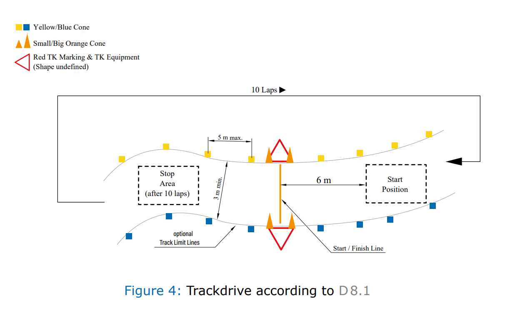
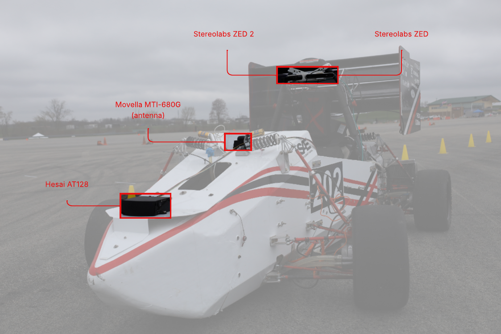
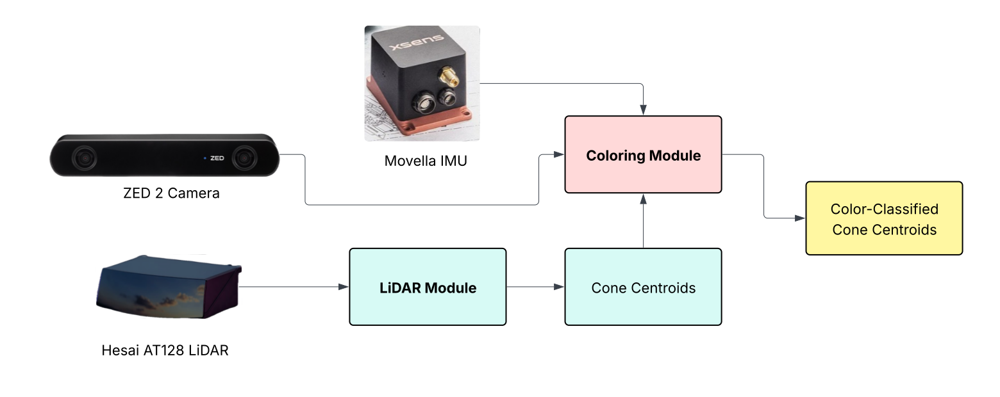

.. _Path Planning: https://cmr.red/planning-docs
.. _Controls: https://cmr.red/controls-docs
.. _Software Architecture: https://cmr.red/software-arch-docs

========================================
Introduction
========================================

Welcome to the Perceptions documentation for Carnegie Mellon Racing (CMR) Driverless! CMR is a 
student organization at Carnegie Mellon University that designs and builds electric and autonomous
formula-style racecars to compete in Formula Student Racing competitions each year.

Perceptions constitutes the system of the car that ingests and interprets sensor data from the environment. 
Via this interpretation, the perceptions module enables `Path Planning`_ and `Controls`_ modules to make high-level
decisions to control the car.

This documentation is meant to provide an introduction and high level conceptual overview to our perceptions pipeline for our 2024-25 racecar, 24a. 
For more detail, including source code, please visit our `GitHub repository <https://github.com/carnegiemellonracing/driverless>`_ 

The FSAE Driverless Perceptions Problem
=======================
Given a track delimited by yellow and blue cones, we must reliably and efficiently determine the track and cones and pass down the driverless pipeline.
Below is a diagram of one of the main FSAE Driverless events, Trackdrive, where teams drive 10 laps of a previously unknown course autonomously.

    *Figure taken from 2025 Formula Student Germany Competition Handbook.*
    
Sensors
=======

    *24a at track testing.*

We employ a variety of sensors to accomplish this task:

- `HESAI AT128 Hybrid Solid State LiDAR <https://www.hesaitech.com/product/at128/>`_
- `Dual ZED2 Stereo Cameras (only used for RGB frames) <https://www.stereolabs.com/products/zed-2>`_
- `Movella MTi-680G RTK GNSS/INS GPS <https://www.movella.com/products/sensor-modules/xsens-mti-680g-rtk-gnss-ins>`_

Using these three sensors we efficiently generate a local view of the track and cones. 

   *Overall Pipeline Diagram*

What data do we work with and where does it go?
===============================================

LiDAR Module
------------

Our single LiDAR provides a primary source of depth information via `point clouds <https://en.wikipedia.org/wiki/Point_cloud>`_, 
which are discrete sets of points in space. Several processing algorithms (see :doc:`lidar explainers <source/explainers/lidar_module>`) 
are then applied, eventually resulting in a set of points that represent the centroid of cones on the track in front of us.

    
Coloring Module
---------------

Our dual RGB cameras provide a primary source of color information. Cameras are used for rgb image processing (see :doc:`coloring explainers <source/explainers/coloring_module>`) to classify cones by color.
Classified cones are then passed down the pipeline to `Path Planning`_ and `Controls`_.

Directory
=========
Checkout the links below to learn more about our sensor stack and our main algorithms!

.. toctree::
   :maxdepth: 2
   :caption: Contents:
   
   source/explainers/explainers
   source/implementation/api_reference
