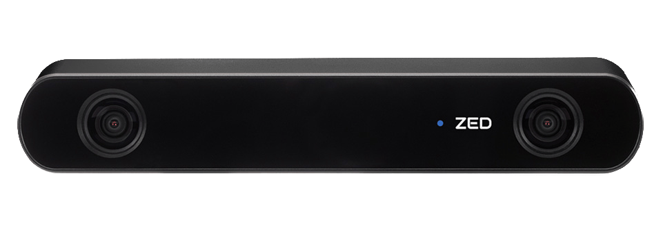

.. _Path Planning: https://cmr.red/planning-docs
.. _Controls: https://cmr.red/controls-docs
.. _Software Architecture: https://cmr.red/software-arch-docs

Coloring Module Concepts
========================

Overview
--------

RGB cameras provide a source color information. Though the two stereolabs ZED cameras used have stereoscopic capability (depth estimation)
we opted to avoid any depth processing due to latency concerns. Instead cameras are used purely for color information.

    *Stereolabs ZED2 Camera used on 25a*

Goal of the Coloring Module
^^^^^^^^^^^^^^^^^^^^^^^^^
The Coloring Module aims to apply RGB color information from cameras to classify cones coming in from the :doc:`LiDAR Module <lidar_module>` by color.
Color classification delineates the sides of the track and allows `Path Planning`_ and `Controls`_ to create midlines and more.

.. admonition:: Info

    - We use ROS2 to implement our pipeline. See `Software Architecture`_ for more.
    - Our coloring module is housed in our custom ROS2 package, :doc:`point_to_pixel <../implementation/coloring_module>`. 

    **Input:** a set of uncolored cone centroids

    * ``/cpp_cones``

        * ``interfaces::msg::PPMConeArray``

    **Output:** a set of colored cone centroids passed down the pipeline to `Path Planning`_ and `Controls`_.

    * ``/perc_cones``

        * ``interfaces::msg::ConeArray``

Algorithm
-------------------------------------------------------------------

.. Note::
    - PPM system diagram

.. figure:: ppm_system_diagram.png
    :width: 600
    :align: center

Simplified Algorithm
^^^^^^^^^^^^^^^^^^^^

.. code-block:: text

    for each cone centroids / camera image do:
        YOLO v5 cone detection inference: bounding boxes of different color/size classes

        for each cone centroid do:
            transform to image space via transform matrix (see Direct Linear Transform below)
            
            if point is within a single bounding box classify as that color

            if point is in multiple boxes use a rough depth heuristic to pick one box

            else label the point as unkown

Notes
"""""

- Point to Pixel Mapping makes the assumption that the cameras remain rigid with respect to the LiDAR at all times. 
- Our YOLO v5 is trained on data from `Formula Student Objects in Context Dataset (FSOCO) <https://fsoco.github.io/fsoco-dataset/>`_
- Depth heuristic uses the idea that the area of the bounding box roughly corresponds to depth 

Complexities related to sensor frame timestamps
^^^^^^^^^^^^^^^^^^^^^^^^^^^^^^^^^^^^^^^^^^^^^^^

The main complexity in our implementation is to solve two problems that crop up as a result of unsynchronized data.

    1. Our sensors have no synchronous trigger, and thus we need to find a way to syncronize data as best as possible.
    2. Our system needs to be robust to a a few errors in coloring due to this LiDAR - camera temporal synchronization issue.

This adds some complexity to the algorithm:

.. code-block:: text

    for each incoming set of cone centroids do: 
        find the camera image in buffer closes to timestamp of centroids (but after)
        
        apply YOLO v5 cone detection to that image: bounding boxes of different color/size classes

        For each cone centroid do:
            motion model point based on velocity and yaw deltas between LiDAR centroid timestamp and image timestamp

            transform to image space via transform matrix (see Direct Linear Transform below)
                
            if point is within a single bounding box classify as that color

            if point is in multiple boxes use a rough depth heuristic to pick one box

            else label the point as unkown

        feed centroids into cone history algorithm to minimize the effect of misclassifications

        apply support vector machine to correct for up to 1-2 misclassifications

Notes
"""""

- Our Movella IMU is used to get velocity and yaw deltas.
- Cone histories and support vector machines make the algorithm far more robust to synchronization issues--especially at faster speeds.

Direct Linear Transform (DLT)
-----------------------------

Why use DLT?
^^^^
It is insufficient to use geometric approaches, e.g, measuring or CAD to estimate the static transformation matrix from camera to LiDAR.
This is due to a multitude of reasons, but primarily results from the difference between design and fabrication. DLT allows for an accurate 
transform to be calculated via calibration instead.

What is DLT?
^^^^^
Instead, we solve for the transform matrix via a calibration sequence that uses a series of (at least 6) points identified by 
hand in both the lidar and camera frames. With those points we can solve for the matrix 

.. figure:: ppm_calibration.JPG
    :width: 400
    :align: center

    *Figure: calibration setup consisting of many cones spread throughout at different heights and depths*

.. Warning::
    This method is heavily dependant on a good calibration. If the sensors move relative to each other 
    or if the calibration points weren't picked at various depths / heights, the accuracy drops off steeply.

.. Note::
    - Add diagram + equations for DLT
