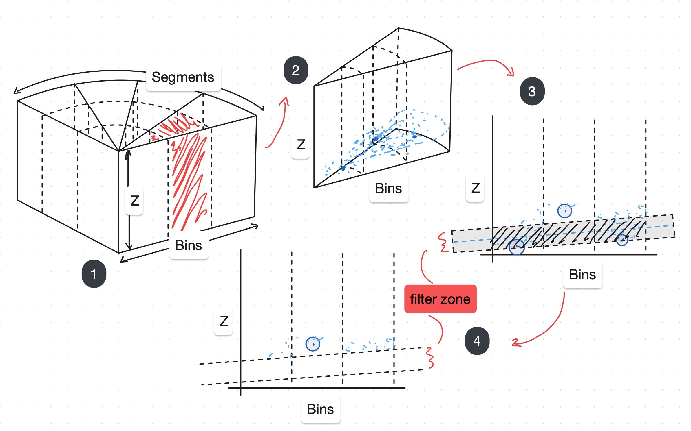
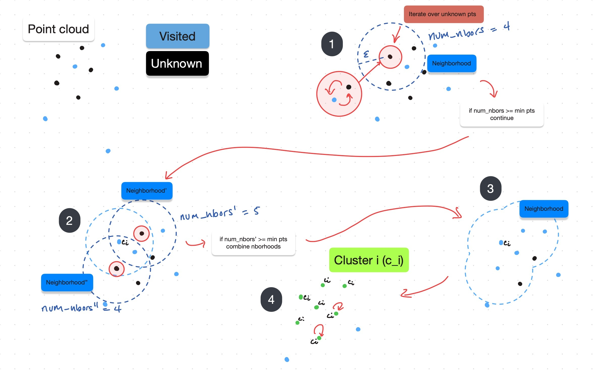

.. _Software Architecture: https://cmr.red/software-arch-docs

LiDAR Module Concepts
=====================

Overview
------------
.. admonition:: Sidebar

    **What is a LiDAR?**

    A LiDAR--Light Detection And Ranging--sensor is a type of time of flight (ToF) sensor that can measure the depth of objects in space. 
    Essentially, it fires a laser to a target and analyzes the reflected light in order to create high-resolution maps. This capability
    makes LiDARs some of the best sensors for object detection, widely used throughout the field of autonomous vehicles. 

    The main output of a LiDAR sensor is a 2d/3d point cloud representation of the environment. A point cloud is a discrete set of points in space.
    Each point represents the distance from the sensor to an object in the environment.

    .. figure:: AT128-1.png
        :width: 200
        :align: center

        *HESAI AT128 Hybrid Solid State LiDAR used on 24a*

Goal of the LiDAR Module
^^^^^^^^^^^^^^^^^^^^^^^^
The LiDAR Module aims to apply spatial information from LiDAR point clouds and process it into a set of points that represent the 
center of cones on the track in front of us.

.. admonition:: Info
    
    - We use ROS2 to implement our pipeline. See `Software Architecture`_ for more.
    - To avoid overhead from publishing the entire LiDAR point cloud to a ROS topic, lidar_module code is integrated directly into the ROS driver available with our LiDAR.

    **Input:** Pointcloud from the LiDAR. Not usually available to the ROS system unless specifically turned on.

    * ``All internal to the HESAI ROS Driver 2.0 Node``

    **Output:** a set of cone centroids. It is a message type from our custom ROS2 ``interfaces`` package.

    * ``/cpp_cones``

        * ``interfaces::msg::PPMConeArray``   

Algorithm
^^^^^^^^^

To get to the output goal of a set of cone centroids several pieces of extraneous data must be removed. 

1. Remove ground--most of the points in the cloud come from the ground and are useless to the goal
2. Identify clusters (cones look like clusters of points)
3. Removes extraneous clusters (could represent buildings, rails, etc...) to have a final set of cone centroids 

The LiDAR Module employs two main algorithms to carry out these steps.

.. figure:: lidar_algo_diagram.svg
    :width: 1000
    :align: center

    *Algorithm diagram*

Ground Filtering
----------------

    *Diagram description of Grace and Conrad*

We use a ground filtering algorithm called :doc:`Grace and Conrad <../implementation/lidar_module>` (named in our codebase after CMR alums Grace and Conrad, who wrote the initial version).

.. code-block:: text

    convert point cloud to radius azimuth coordinates
    
    for each bin do:
        find the point with the minimum height

    fit a plane to those points (linear regression in r-z plane)

    filter out all points within a height threshold of the regression

Notes
''''''

- Grace And Conrad makes the assumption that the ground is relatively planar

Clustering
----------------

:doc:`Density-Based Spatial Clustering of Applications with Noise (DBSCAN) <../implementation/lidar_module>` is used to identify clusters of points.
The basic algorithm is below and a more detailed pseudocode can be found in the `DBSCAN Wikipedia article <https://en.wikipedia.org/wiki/DBSCAN>`_.

    *Diagram description of DBSCAN*

.. code-block:: text

    for each point P in the filtered cloud do:

        if P already processed by loop, continue

        find all neighbors of P within an epsilon (ε)

        if number of points in neighborhood greater than min points do:
            label P as a cluster point
            
            recursively test if neighbors meet the same cluster criterion (see wiki linked below for full pseudocode)
        else:
            filter out

Notes
''''''

- DBSCAN makes the assumption that all clusters of sufficient density left represent cones. Extraneous clusters are filtered in DBSCAN2 (see `API Reference <../implementation/lidar_module>`_)
- `DBSCAN Wikipedia reference <https://en.wikipedia.org/wiki/DBSCAN>`_
- `DBSCAN original paper <https://dl.acm.org/doi/10.5555/3001460.3001507>`_